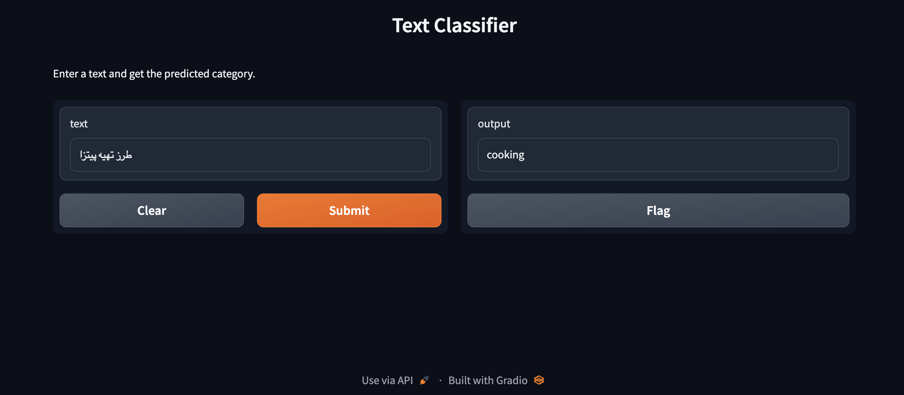

# MCI Text Classification
Hamrah Aval Text Classification Project


This project focuses on classifying text data into different categories using various machine learning and deep learning techniques. It covers data preprocessing, word embeddings, model development, evaluation, and ensemble prediction.

## Table of Contents

- [Using the Text Classifier Interface](#using-the-text-classifier-interface)
- [Project Overview](#project-overview)
- [Getting Started](#getting-started)
  - [Clone the Repository](#clone-the-repository)
  - [Dependencies](#dependencies)
- [Data Preprocessing](#data-preprocessing)
- [Word Embeddings](#word-embeddings)
- [Model Development and Training](#model-development-and-training)
- [Model Evaluation](#model-evaluation)
- [Ensemble Prediction](#ensemble-prediction)
- [Model Comparison](#model-comparison)


## Using the Text Classifier Interface

To make use of the text classification model developed in this project, you can interact with the user interface provided. Follow these steps to utilize the interface for predicting the category of a given text:

1. **Launch the Interface**: Run the provided code to launch the interface. You can do this by executing the script or cell containing the code snippet.

2. **Enter Text**: In the interface, you will find an input field labeled "text." Enter the text you want to classify into this field.

3. **Get Predicted Category**: After entering the text, click the interface's "Submit" or "Predict" button (depending on the interface design). The model will process the input text and predict its category based on the trained machine learning models.

4. **View Predicted Category**: The predicted category will be displayed as the output of the interface. This represents the model's classification for the provided text.

Feel free to experiment with different texts to observe how the model classifies them. This user-friendly interface simplifies the process of obtaining predictions from the text classification model.

Remember that the accuracy of predictions depends on the quality of the training data and the performance of the underlying Machine Learning models used in the project.



## Project Overview

This project focuses on classifying text data into different categories using a range of machine learning and deep learning techniques. It encompasses data preprocessing, word embeddings, model development, evaluation, and ensemble prediction.

## Getting Started

Follow these instructions to get a copy of the project up and running on your local machine.

### Clone the Repository

To clone this repository to your local machine, use the following command:

```bash
git clone https://github.com/hossein-zandinejad/MCI-Text-Classification.git
```
### Dependencies

Make sure you have the following dependencies installed:

Python (>=3.6)
Jupyter Notebook
Libraries: numpy, pandas, nltk, gensim, wordcloud, matplotlib, plotly, scikit-learn, tensorflow, keras
You can install the required Python libraries using pip:
```bash
pip install numpy pandas nltk gensim wordcloud matplotlib plotly scikit-learn tensorflow keras
```
## Data Preprocessing

In this section, the project loads a JSONL dataset containing textual information, partitions it into training and test sets, and preprocesses the text data by tokenizing, lemmatizing, and removing stopwords.

## Word Embeddings

The project utilizes Word2Vec and FastText embeddings to represent text data as continuous vectors. These embeddings capture semantic nuances within the text.

## Model Development and Training

Various machine learning models are employed for text classification, including Multinomial Naive Bayes, Support Vector Classifier (SVC), Logistic Regression, Decision Tree Classifier, and Random Forest Classifier. Additionally, a deep learning LSTM neural network is implemented.

## Model Evaluation

Each model is trained and assessed on the preprocessed text data. Performance metrics such as accuracy, precision, recall, and F1-score are computed to gauge model effectiveness.

## Ensemble Prediction

The project incorporates an ensemble approach, combining predictions from multiple models to make a consensus prediction for a given input text. This ensemble method leverages the strengths of various models to enhance overall classification accuracy.

## Model Comparison

A bar chart is generated to provide a visual comparison of the accuracies achieved by different models. This comparative analysis facilitates the evaluation and selection of the most suitable model for the text classification task.
